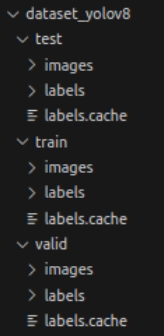
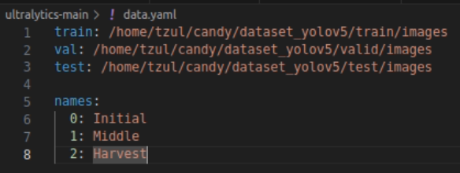
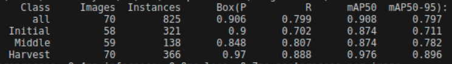
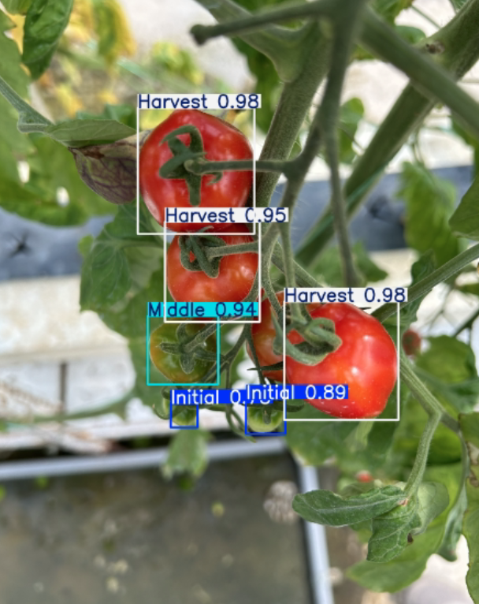

 # Lab: DeepLearning2 pracitice: yolov8
###### b11611001王宥姍

<br/>

## 1. 準備資料
首先準備要訓練的資料集，可以用這個架構區分train, validation, test三種資料集，架構圖如下：
<p>
    
<p>
每個資料夾中各有images、labels兩資料夾，分別放jpg和txt檔，因此前置作業要先將原始檔案中的json格式轉為txt格式。

我準備的資料集中，train/valid/test = 277/70/105 筆。

<br/>

接下來要準備一個 **data.yaml** 檔，負責設定路徑跟標記類別數量( nc )、標記名稱(names)，以下為我的範例：
<p>
    
<p>


<br/>

## 2.安裝

```
pip install ultralytics
```
其他的基本環境設置可以參考：
[YOLOv8 基本環境與教學](https://hackmd.io/@luckychi/yolov8_simple_tutorial)

YOLOv8 github 下載：
https://github.com/ultralytics/ultralytics

<br/>

## 3.開始訓練

* **進行訓練**

    我使用了Python指令來進行訓練：
    ```
    from ultralytics import YOLO

    # Load a model
    model = YOLO("yolov8n.yaml")  # build a new model from scratch
    model = YOLO("yolov8n.pt")  # load a pretrained model (recommended for training)

    # Use the model
    model.train(data="data.yaml",mode="detect",epochs=400,batch=64,imgsz=640,device="cuda")
    ```
    可以調整epoch, batch參數，或自行新增。
    訓練完後的資料會出現在runs/detect/train底下，訓練好的模型放在runs/detect/train/weights底下。

    我測試下來較佳的參數配置為epoch=223,batch=64，出來的結果如下，precision達0.906：
    <p align="center">
        
    </p>

    **我最佳的訓練權重檔案:**
    https://drive.google.com/drive/folders/1LHVnplcV6Tb5I7Y7_XHa8xa-89-Zzq_1?usp=sharing

<br/>

* **進行估測**

    之後的evaluation步驟可以參考這個，使用best.pt來進行估測：
    ```
    from ultralytics.models.yolo.detect import DetectionValidator

    args = dict(model="/home/tzul/candy/runs/detect/e150_b64/weights/best.pt", data='data.yaml')
    validator = DetectionValidator(args=args)
    validator()
    ```
    需要注意的是，因為v8內的程式指定會讀data.yaml中的val: 這行，因此若需要最後用test資料庫去呈現，要將val: 後面的路徑改成test/images。

<br/>

* **照片預測**

    可以用這個指令來存取經由best.py預測出來的實際預測圖。
    ```
    from ultralytics import YOLO

    model = YOLO("/home/tzul/candy/runs/detect/e150_b64/weights/best.pt")

    result = model.predict(source="/home/tzul/candy/dataset_yolov5/test/images", mode="predict", save=True, device="cuda")
    ```
    實際預測圖類似這樣：
<p align="center">
        
    </p>